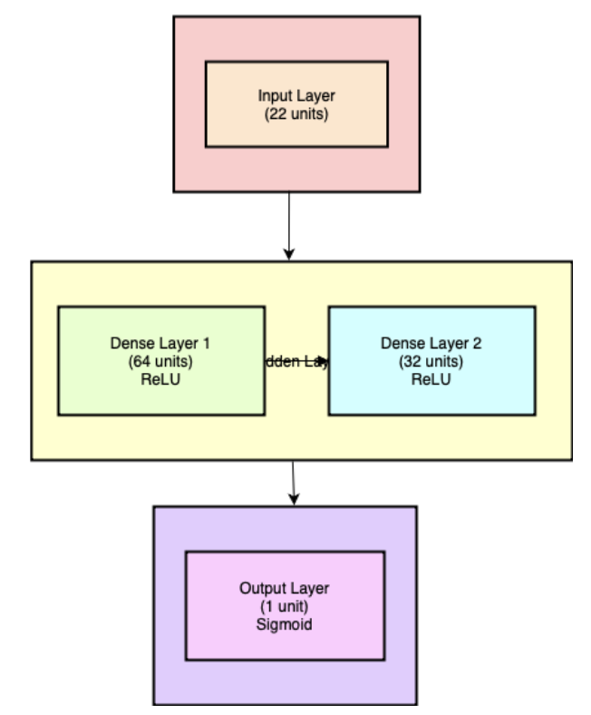
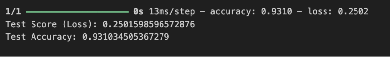

# Parkinson Disease Detection using ESP32

## Overview
This project implements a machine learning pipeline for the detection of Parkinson's Disease using voice data features. The trained model is deployed on an ESP32 microcontroller for real-time inference, enabling portable and low-cost health diagnostics.

## Project Structure
- **new.ipynb**: Main Jupyter notebook for data preprocessing, model training, evaluation, and conversion to TensorFlow Lite.
- **ESP32/parkinson/**: Arduino code and model header for ESP32 deployment.
- **images/**: Visualizations and results.
- **parkinsonDataset.csv**: Dataset used for training and evaluation.
- **parkinson.h5 / parkinson.tflite / parkinsonl.tflite**: Saved models in various formats.

## Dataset
The dataset (`parkinsonDataset.csv`) contains 195 samples with 22 voice features extracted from audio recordings. The target variable is `status` (1: Parkinson's, 0: Healthy).

## Workflow
1. **Data Preprocessing**: Features are normalized and split into training, validation, and test sets.
2. **Model Architecture**:
   - Input: 22 features
   - Dense (64, ReLU) → Dense (32, ReLU) → Dense (1, Sigmoid)
   - Optimizer: Adam, Loss: Binary Crossentropy

   

3. **Training & Evaluation**:
   - The model is trained for 100 epochs with batch size 32.
   - Achieved test accuracy: **~89.7%**

   
   

4. **Model Conversion**:
   - The trained model is converted to TensorFlow Lite (`parkinson.tflite`) and then to a C header file for ESP32 deployment.

5. **ESP32 Deployment**:
   - The ESP32 runs inference using the quantized model and outputs predictions via serial.
   - Example Arduino code is provided in `ESP32/parkinson/parkinson.ino`.

   

## How to Run
### 1. Train and Convert the Model
- Open `new.ipynb` in Jupyter Notebook.
- Run all cells to preprocess data, train the model, and generate the TFLite and header files.

### 2. Deploy to ESP32
- Copy `parkinson_esp32.h` and `parkinson.ino` to your Arduino project.
- Flash the ESP32 with the code.
- Open the serial monitor to view predictions.

## Results
- The model demonstrates robust performance on the test set and runs efficiently on ESP32.
- See the images above for training curves and ESP32 inference output.

## Requirements
- Python 3.x, TensorFlow, scikit-learn, numpy, pandas, matplotlib
- Arduino IDE, EloquentTinyML library for ESP32

## Acknowledgements
- Dataset source: [UCI Machine Learning Repository](https://archive.ics.uci.edu/ml/datasets/parkinsons)
- Model deployment inspired by EloquentTinyML

---
*Author: Kashish Varma* 